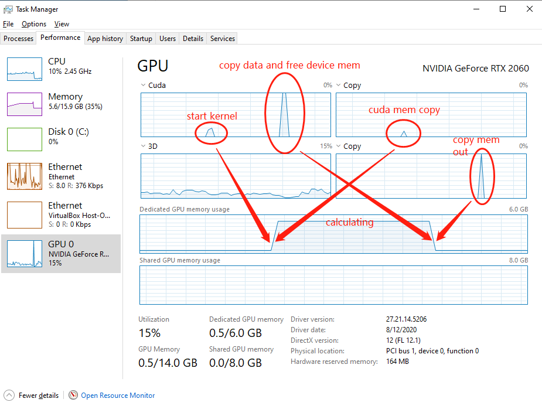

# HW1 Report

##### Name: Haixu Song;   CWID: 10446032


## Objective

Implement a tiled dense matrix multiplication routine (C=A*B) using shared memory in  CUDA. A and B matrix elements can be randomly generated on the host. Your code should  be able to handle arbitrary sizes for input rectangular matrices.

## How to run this code

#### Step 1: Environment

The source code is based on **CUDA 11.0**. Please make sure you've installed CUDA and your system is able to find **cl.exe** in path. You can check your environment by `nvcc --version` and `cl.exe` in the windows command prompt.

#### Step 2: Compile Source Code (Optional)

You can use `nvcc hw1.cu -o exeFileName` to compile the  source code and you will find that there's 3 new files generated. `exeFileName.exe` is the executable file we gonna run later; `exeFileName.lib` and `exeFileName.exp` are the files that other projects may use. For this project, we can only keep the executable file.

*This step is optional, you can find the compiled file in the `./bin` directory named `matrixMul.exe`* 

#### Step 3: Run the Executable File

You can run the executable file we just compiled in Step 2. Suppose the file name is `matrixMul.exe`. Then you can use `matrixMul.exe --help` for instructions.

```
Your_Directory>matrixMul.exe --help

We need 3 parameters j,k,l which represents the two matrix's dimention.
The first one with size j*k, and the second one's is k*l.
j,k,l must be int type and greater than 0.

Application terminates.
```

You see that we need 3 variables as input which represents the size of the two matrix. When you input something strange, the program terminates after telling you the input is incorrect.

```
Your_Directory>matrixMul.exe wrongParam

Error.
We need 3 parameters as input.
You can use '--help' for more details.

Application terminates.
```

```
Your_Directory>matrixMul.exe 20 3 string

Number Of Arguments Passed: 4
----Following Are The Command Line Arguments Passed----
argv[1]: 20
argv[2]: 3
argv[3] is invalid
Application terminates.
```

The program can only run while the arguments passed is valid, which means 3 integers that are greater than 0.

```
Your_Directory>matrixMul.exe 2 3 2

Number Of Arguments Passed: 4
----Following Are The Command Line Arguments Passed----
argv[1]: 2
argv[2]: 3
argv[3]: 2
Continuing with j=2, k=3, l=2
7.496872        5.571459        1.036409
5.250404        7.373577        4.760277

0.321360        3.234962
5.419782        0.503250
0.863674        7.949461

Done initializing matrix A with size 2*3 and matrix B with 3*2
Done matrix multiplication with CPU
33.500408       35.294823
45.761780       58.537254

Done allocating space in device.
Done copying memory from host to device
Done initializing block dimention and grid dimention.
Done matrix multiplication with GPU.
33.500408       35.294827
45.761780       58.537254

Result check: ---PASS---.
```

Notice that the command prompt will show the matrix only when the matrix has less than 5 elements in all dimensions. 

```
Your_Directory>matrixMul.exe 2000 2000 2000

Number Of Arguments Passed: 4
----Following Are The Command Line Arguments Passed----
argv[1]: 2000
argv[2]: 2000
argv[3]: 2000
Continuing with j=2000, k=2000, l=2000
Done initializing matrix A with size 2000*2000 and matrix B with 2000*2000
Done matrix multiplication with CPU
Done allocating space in device.
Done copying memory from host to device
Done initializing block dimention and grid dimention.
Done matrix multiplication with GPU.
Result check: ---PASS---.
```

## Implementation Details

The main function is implemented in the following sequence.

#### Step 1: Setting Random Seed

To make sure that every time running the program generates different matrix elements even with the same size.

#### Step 2: UI Function

Get the arguments from the command line and interact with the user. The function that users can use `matrixMul.exe --help` is implemented here. This part can also check if the input arguments are valid.

#### Step 3: Initialize Two Matrix

This part generates elements of matrix with float type. The range of the matrix elements is pre-defined in Macro at the top of the code. In this code, it's 0-10. You can change it and recompile the source code if you want other range.

#### Step 4: Dot Product From CPU

Calculate the two matrix dot product using single core CPU. I did this so that I can compare this value with the GPU result to make sure my algorithm didn't go wrong.

 There's better algorithm like Strassen Method. But I didn't use that because the algorithm is a little complex due to those equations and it's not the point here to show the CPU running performance. I used the most stupid way, just 3 round nested for loop with O((2k-1)\*j\*l) complexity.

#### Step 5: Allocate Device Memory

Allocate device memory for matrix and transfer those data from host to device

#### Step 6: Initializing gridDim and blockDim

Block size is pre-defined as 16, same as the tile size. You may change it and recompile the source code if you want another. Grid size is calculated by the dimension of the matrix and block size. 

#### Step 7: Launch CUDA Kernel

Note: why I called time stopping after cudaMemcpy? This is because the CUDA function is async, which means after calling CUDA function, host code continue going on, while the GPU is still calculating. So if we put the time stopping after another CUDA API, it will wait this API done running, then stop the watch. So this may cause a little error of GFLOPS calculation, but it's better than 0 microseconds. 

#### Step 8: Get Result and Free Device Memory

Copy the result from device global memory to host. Then free those memory allocated for these matrices.

#### Step 9: Check The Result

I used relative error as the metric. The machine zero is pre-defined as Macro. I assumed the CPU value as the real value and GPU value as the value we got to calculate the relative error. If the error is less than the machine zero, I'll assume that there's no calculating mistake.

## Result Analyzing

My code runs well. Here's some running examples:

When the matrix is small, it runs fast both in CPU and GPU. In this case, there's about 100% thread divergence happed:

```
Your_Directory>matrixMul.exe 2 3 2

Number Of Arguments Passed: 4
----Following Are The Command Line Arguments Passed----
argv[1]: 2
argv[2]: 3
argv[3]: 2
Continuing with j=2, k=3, l=2
6.886807        7.546922        5.529038
1.885434        4.930571        1.637013

6.517228        8.511002
5.562609        9.004486
1.844234        2.803430

Done initializing matrix A with size 2*3 and matrix B with 3*2
Done matrix multiplication with CPU
0 microseconds used.

97.060303       142.070053
42.733669       65.033432

Done allocating space in device.
Done copying memory from host to device
Done initializing block dimention and grid dimention.
Done matrix multiplication with GPU.
0 microseconds used.

97.060303       142.070053
42.733669       65.033432

Result check: ---PASS---.
```

When the matrix is large enough like 2000, the CPU will take about 1.5 minute to have it done, while the GPU takes just 50 microsecond.

```
Your_Directory>matrixMul.exe 2000 3000 2000

Number Of Arguments Passed: 4
----Following Are The Command Line Arguments Passed----
argv[1]: 2000
argv[2]: 3000
argv[3]: 2000
Continuing with j=2000, k=3000, l=2000
Done initializing matrix A with size 2000*3000 and matrix B with 3000*2000
Done matrix multiplication with CPU
94749 microseconds used.

Done allocating space in device.
Done copying memory from host to device
Done initializing block dimention and grid dimention.
Done matrix multiplication with GPU.
50 microseconds used.

Result check: ---PASS---.
```

When the matrix size goes to 20000, which is about the maximum of my device can carry. The result is:

```
Your_Directory>matrixMul.exe 20000 20000 20000

Number Of Arguments Passed: 4
----Following Are The Command Line Arguments Passed----
argv[1]: 20000
argv[2]: 20000
argv[3]: 20000
Continuing with j=20000, k=20000, l=20000
Done initializing matrix A with size 20000*20000 and matrix B with 20000*20000
Done allocating space in device.
Done copying memory from host to device
Done initializing block dimention and grid dimention.
Done matrix multiplication with GPU.
22314 microseconds used.
```

We can see that the result can calculated within 1microsecond. But this is the largest matrix my device can hold. Let's do the math. Assume A \* B = C are 3 square matrix with width N, then in order to hold all 3 matrix in the global memory, we may use 3N^2 \* sizeof(float) = 12N^2 byte space. Mine is 6GB = 6\*1024\*1024\*1024 = 6,442,450,944 bytes. So N is about 23,170. We can also prove that from the GPU behavior tracing from Windows Task Manager.



Let's calculate the GFLOPS. With j = k = l = 20000, the float point operations we've done is actually (20000\*20000)\*(20000+19999) = 15999600000000 and we did it in 22314 microseconds = 22.314s. So GFLOPS = 15999600000000 / 22.314 = 717,020,704,490.4544 = 717 GFLOPS. I checked the official website of RTX 2060 GPU. It said this chip's highest 32digit float-point can calculate at a maximum 6.451TFLOPS. Our result is quite reasonable. 

The result is totally within my previous imagination. Sequence code takes a long time, but multi-threads GPU takes just a short short instant like FLASH. Two ways got the same result. The code works well even when the matrix is not square or the matrix size is not multiple of the TILE_SIZE.

Before further analyzing, we have to know what the device I used for this kernel; This is the device code I used for getting device properties.

```c
# include "cuda.h"
# include "cuda_runtime.h"
# include <stdio.h>

int main() {
	int dev_count;
	cudaGetDeviceCount(&dev_count);
	cudaDeviceProp dev_prop;
	for (int i = 0; i < dev_count; i++) {
		cudaGetDeviceProperties(&dev_prop, i);
	}

	printf("Number of devices is: %d \n", dev_count);
	printf("Device name: %s\n", dev_prop.name);
	printf("How many MS in this device: %d\n", dev_prop.multiProcessorCount);
	printf("Clock frequency of this device: %d\n", dev_prop.clockRate);
	printf("How many threads in each block dimention: %d %d %d\n", dev_prop.maxThreadsDim[0], dev_prop.maxThreadsDim[1], dev_prop.maxThreadsDim[2]);
	printf("How many blocks in gird dimention: %d %d %d\n", dev_prop.maxGridSize[0], dev_prop.maxGridSize[1], dev_prop.maxGridSize[2]);
	printf("Max threads per block: %d\n", dev_prop.maxThreadsPerBlock);
	
	printf("Wrap size: %d\n", dev_prop.warpSize);
	printf("Total global memory: %I64d\n", dev_prop.totalGlobalMem);
	printf("Total const memory: %I64d\n", dev_prop.totalConstMem);

	printf("Shared memory per SM: %I64d\n", dev_prop.sharedMemPerMultiprocessor);
	printf("Shared memory per block: %I64d\n", dev_prop.sharedMemPerBlock);

	printf("Register per SM: %d\n", dev_prop.regsPerMultiprocessor);
	printf("Register per block: %d\n", dev_prop.regsPerBlock);

	printf("Max block in SM: %d\n", dev_prop.maxBlocksPerMultiProcessor);
	printf("Max threads in SM: %d\n", dev_prop.maxThreadsPerMultiProcessor);

	return 0;
}
```

And here's the device property of my device.

```
Number of devices is: 1
Device name: GeForce RTX 2060
How many MS in this device: 30
Clock frequency of this device: 1710000
How many threads in each block dimention: 1024 1024 64
How many blocks in gird dimention: 2147483647 65535 65535
Max threads per block: 1024
Wrap size: 32
Total global memory: 6442450944
Total const memory: 65536
Shared memory per SM: 65536
Shared memory per block: 49152
Register per SM: 65536
Register per block: 65536
Max block in SM: 16
Max threads in SM: 1024
```

In my code, the BLOCK_SIZE is 16\*16, so that there's 1024/(16\*16) = 4 block in each SM. So in each block, there must be 16\*16\*2 = 512 float numbers needs to be stored in shared memory which will take 512*4 = 2048 bytes, far from the share memory limit of the SM or the block. So the BLOCK_SIZE works good. 

There's some hardware limitations that will take charge only when the size of the matrix goes too big. eg. My global memory is 6GB which can holds 6442450944/4 = 1610612736 float numbers. Assume all 3 matrices is sized N\*N, then the max N will be 23170. That's too big a matrix that I can't validate the answer calculated, because the CPU sequence code may take hours to do it. Another hardware limitation is the grid size. My limitation is 2147483647, 65536, 65536. This limitation can hold much much more threads, that even global memory can't store enough data for them to process. 

## Answering Questions

**How many floating operations are being performed in your dense matrix multiply kernel if the matrix size is N times N? Explain.**

> Let's name the matrices A,B and C, where A*B=C. If we assume all matrices are N\*N in size, then:
>
> When calculating each element in C, we need N multiplications, and N-1 additions. So the total FLOP is **(2N-1)\*N\*N = O(N^3)**.

**How many global memory reads are being performed by your kernel? Explain.**

> Assume we are also talking about A*B=C, but the size becomes j\*k for A and k\*l for B. Thus matrix C is sized j\*l. 
>
> In the output, we got ceil(j/TILE_SIZE)\*ceil(l/TILE_SIZE) blocks to cover all the elements. In each block, we got TILE_SIZE\*TILE_SIZE threads. Each threads reads element from global ceil(k/TILE_SIZE) times. SO all in all, the total global memory access time is **ceil(j/TILE_SIZE)\*ceil(l/TILE_SIZE)\*TILE_SIZE^2\*ceil(k/TILE_SIZE)**.
>
> If we assume that j=k=l=N, and the final result can be **ceil(N/TILE_SIZE)^3\*TILE_SIZE^2 = O(N^3/TILE_SIZE)**.

**How many global memory writes are being performed by your kernel? Explain.**

> Assume we are also talking about A*B=C, but the size becomes j\*k for A and k\*l for B. Thus matrix C is sized j\*l. 
>
> Each element in C writes 1 time to the global memory because the array d_C is stored there. So the answer will simply be **j*l**.

**Describe what further optimizations can be implemented to your kernel to achieve a performance speedup.**

> Comparing to the sample code provided by CUDA official, my code needs 2 more things. One is the CUDA error processor. All CUDA API returns the error type but I didn't take use of it. There's no error handling code in it. The second one is the stream control. We can see that the sample code can supervise the kernel processing by the stream variable and finally it gave out the running speed and throughput.
>
> From what I learned from our Text Book----PMPP 3rd edition, I should make dynamic block dimension and dynamic TILE_SIZE due to the device the kernel gonna run on. But from what we learned, I only know how to calculate the limitations. I know nothing about how to do the optimizing. 

**Suppose you have matrices with dimensions bigger than the max thread dimensions allowed in CUDA. Sketch an algorithm that would perform matrix multiplication algorithm that would perform the multiplication in this case.**

> I think we can also use the idea of **tiling**, but this time we can make tiles on the kernels instead of just on global memory. We can do several kernels and each kernel just focus  on a small tile matrix, whose dimensions are below limitation. 
>
> Or there's a very famous algorithm in calculating matrix multiplication called **Strassen**. I used the idea of divide and conquer so that in this case, we can make each kernel focus on each divided sub-matrix and join the final result outside the kernel.

**Suppose you have matrices that would not fit in global memory. Sketch an algorithm that would perform matrix multiplication algorithm that would perform the multiplication out of place.**

> Same with the previous question, I think we can also use the idea of **tiling**, but this time we can make tiles on the kernels instead of just on global memory. We can do several kernels and each kernel just focus  on a small tile matrix, whose memory needs are below limitation. We can just combine the kernel results in host memory.


Github: https://github.com/HaixuSong/GPU_Programming_CUDA_HW/tree/master/hw1