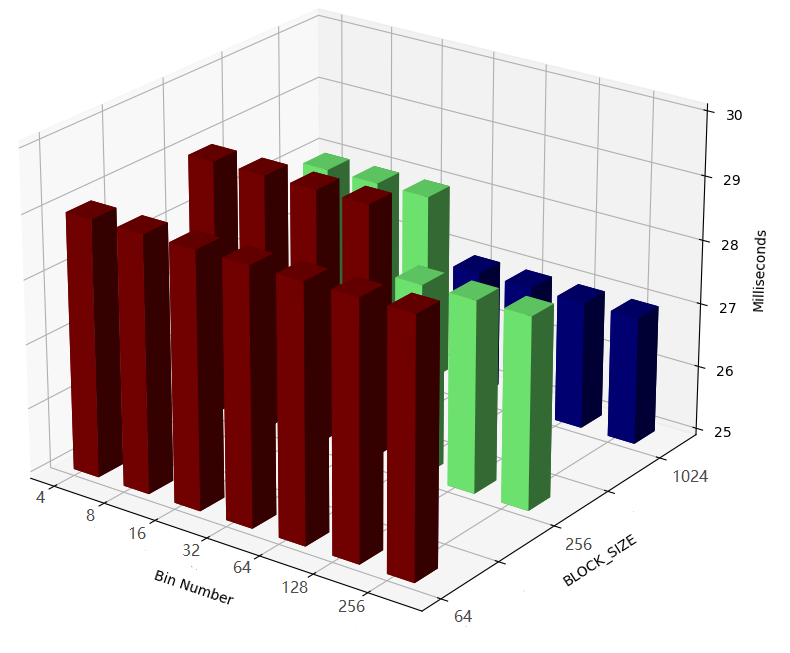
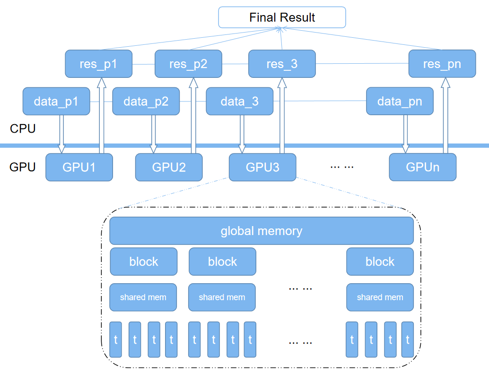

# HW2 Report

##### Name: Haixu Song;   CWID: 10446032

## Objective

Implement a histogram routine using atomic operations and shared memory in CUDA. Your code should be able handle arbitrary input vector sizes (vector values should be randomly generated using integers between 0~1024).

## How to run this code

This part is the same with [HW1](https://github.com/HaixuSong/GPU_Programming_CUDA_HW/blob/master/hw1/HW1 Report.md#how-to-run-this-code). There's no verbose explaining here.

## Implementation Details

The main function is implemented in the following sequence. The same part as in homework 1 is omitted.

#### Step 1: Setting Random Seed

[Same with HW1.](https://github.com/HaixuSong/GPU_Programming_CUDA_HW/blob/master/hw1/HW1 Report.md#step-1-setting-random-seed)

#### Step 2: UI Function

Comparing with the UI in HW1, I did it better this time by making the UI more like Linux.

```
...\yourDirectory>hist -h
CUDA Programming Homework. Histogram Algorithm.

Usage: hist [OPTION]...

Options:
   -h, --help     Show helping information.
   -i, --input    Followed by 2 integers as input parameters.

Examples:
hist -h
  Shows the helping information.
hist -i 8 200
  8 represents 8 bins in histogram, 200 means the length of the data

Application terminates.
```

#### Step 3: Initialize Data Array

As requested from homework's objective, I generated data using rand() with range [0~1024).

#### Step 4: Histogram Counting From CPU

Counting the histogram of the data array using single core CPU. I did this so that I can compare this value with the GPU result to make sure my algorithm didn't go wrong.

The algorithm is very simple. Just iterate all elements one time and add one to the corresponding bin. The complexity is O(n).

#### Step 5: Allocate Device Memory

Allocate device memory for data array and histogram array. Then transfer those data from host to device

#### Step 6: Launch CUDA Kernel

The grid dimension and block dimension are both 1 since we are processing an array. Last time I handled the async in a wrong way. This time I used a cudaDeviceSynchronize() function to wait for the kernel ends, so that we can use clock() to calculate the time kernel function used. 

#### Step 8: Get Result, Free Device Memory, Check Result

Copy the result from device global memory to host. Then free those memory allocated for these arrays. Check the result simply by checking if all elements with the same index in CPU result and GPU result are the same.

## Result Analyzing

#### Coding Analyzing

Comparing with last homework, I made some improvement. The first one is checkCUDAError() function. This function can make the use of cudaError_t returned by CUDA API. If there's error, it make the application stops and report the error information in command prompt. Like the last two lines in below case.

```
...\yourDirectory>hist -i 4 2000000000
Bin numbers: 4
Array length: 2000000000
data:
[ 231, 463, 427, 520, 528, 972, 397, 546, 717, 445...]
Done initializing data array with length 2000000000.

hist_CPU:data:
[500001293,500001313,500000378,499997016]
Done histogrm calculation with CPU in 8845 miliseconds.

Error: cudaErrorMemoryAllocation
out of memory
```

My second improvement is the UI part. I made it exactly meets the requirement of the homework, using -i following parameters as the input. And I made the help prompt in Linux style so that it's more readable.

#### Parameters Bounds and Hardware Resources

My device is NVIDIA RTX 2060. 
My device global memory is 6 GB. 
My system's integer size is 4 bytes.
So: the largest data my device can store once a kernel is 6 \* 1024 \* 1024 \* 1024 / 4 = 1,610,612,736 integers.
In reality testing, the most integers my device can hold is less than 1.5 million, since my operating system used part of it. What's more, I used integer as the index to iterate all elements. In my system, integers are ranged from -2,147,483,648 to 2,147,483,647. There's no overflow happening. But of course, unsigned integers are better.

In my code, there are 256 threads in each block. 
My device allows at most 1024 threads or 16 blocks each SM. 
So: there will be 4 blocks in each SM and 256 threads in each block.

In my code, each block needs bin * 4 bytes shared memory (bin is 2^n where n is ranged [2~8]).
My device allows at most 65536 bytes shared memory per SM.
So: all shared memory needed for a SM is 2^n \* 4 \* 4 = 2^(n+4) bytes which is ranged [64~4096]. Far lower than 65536.

All other limitations can be easily checked valid even without calculating (like max threadDim.x and etc.), so I didn't put these parameters into this report analyzing.

#### Performance

This is the result when data length is small.

```
...\yourDirectory>hist -i 4 10
Bin numbers: 4
Array length: 10
data:
[ 386, 286, 914, 844, 527, 609,  67,   7, 690, 575]
Done initializing data array with length 10.

hist_CPU:data:
[   2,   2,   4,   2]
Done histogrm calculation with CPU in 0 miliseconds.

Done allocating space in device.
Done copying memory from host to device.
Done initializing device histogram with zeros.

Done initializing block dimention and grid dimention.
Done matrix multiplication with GPU in 0 miliseconds.
hist_GPU:data:
[   2,   2,   4,   2]

Result check: ---PASS---.
```

We can easily see that GPU is slower since there's no much calculation needed while GPU did a lot of data transferring and there's significant threads divergence happening. Let's see what's the result will be like when the data length is a medium number.

```
...\yourDirectory>hist -i 8 1234567
Bin numbers: 8
Array length: 1234567
data:
[ 227, 870, 967, 150, 834, 809, 547, 471, 709, 521...]
Done initializing data array with length 1234567.

hist_CPU:data:
[154510,154585,153710,154271,154176,153945,155042,154328]
Done histogrm calculation with CPU in 5 miliseconds.

Done allocating space in device.
Done copying memory from host to device.
Done initializing device histogram with zeros.

Done initializing block dimention and grid dimention.
Done matrix multiplication with GPU in 0 miliseconds.
hist_GPU:data:
[154510,154585,153710,154271,154176,153945,155042,154328]

Result check: ---PASS---.
```

We see that GPU stills getting 0 or 1 milliseconds, but CPU times for running sequential code is rising. In this case, it's about 1 million data points. Let's see the performance when the size of data is about to the edge of my device can hold.

```
...\yourDirectory>hist -i 256 1234567890
Bin numbers: 256
Array length: 1234567890
data:
[ 180, 307, 147, 457, 603, 373, 354, 736, 971, 329...]
Done initializing data array with length 1234567890.

hist_CPU:data:
[4822920,4822530,4822335,4822494,4822509,4822841,4822297,4822940,4822657,4822837...]
Done histogrm calculation with CPU in 5443 miliseconds.

Done allocating space in device.
Done copying memory from host to device.
Done initializing device histogram with zeros.

Done initializing block dimention and grid dimention.
Done matrix multiplication with GPU in 28 miliseconds.
hist_GPU:data:
[4822920,4822530,4822335,4822494,4822509,4822841,4822297,4822940,4822657,4822837...]

Result check: ---PASS---.
```

We see that sequential code takes about 10 times the time GPU needed. The advantage of parallel algorithm is huge when the data size is huge. In this case, total integer operations are data_length + block_number * bin_number = 1234567890 + 120 * 256 = 1,234,598,610. So GFLOPS is about 1234598610 / 0.028 = 44092807500 = 44.1GFLOPS.

## Answering Questions

Consider an N-dimensional input vector for the histogram computation with M bins

> I didn't quite understand what does N-dimensional input vector means since in this week's homework, the input vector is defined 1 dimension. So I just assume this N refers the length of the first dimension, aka length of the vector.

**1. Describe all optimizations you tried regardless of whether you committed to them or abandoned them and whether they improved or hurt performance. Which optimizations gave the most benefit? **

> **INTERLEAVED PARTITIONING**
> Interleaved partitioning makes the neighboring threads visits the neighboring memory address in global memory. So that these visiting can be coalesced in order to make more global memory visiting throughput.
>
> **Privatization**
> While doing atom operations, the memory accessing speed is the bottle-neck of the performance. In order to improve this, we can make a private histogram in each block shared memory. After doing each block's histogram counting, we then add each block's result into global memory. In this way, we reduced the global memory access by 1 / blockDim.x and used faster shared memory accessing instead of global memory accessing.
>
> **Static Thread Numbers**
> I found this optimization method when reading text book code. In Chapter 9, the code to count histogram used a for loop so that each thread process multiple data elements. I thought that maybe by doing so, the performance may get better because the kernel don't have to initialize and terminate more threads than it can hold at a time. So I did an experiment. Firstly, I used dynamic thread numbers, which is determined by the data array length. It took 59 milliseconds when length is about 1.2 billion. Then, I used static thread numbers but each thread process multiple data elements using a for loop. Since my device has 30 SM, and each SM has 4 blocks for this kernel, I made the gridDim.x = 30 * 4 = 120. The final result for the same 1.2 billion array length comes to 27 milliseconds, about 50% of the previous one.
> However, this optimization may have scalability issue. This kernel configuration may doing well on my device, but may not on others'. I think there's a better way to determine the thread numbers depending on the device properties.
>
> **DIDN'T USE AGGREGATION**
> Aggregation is designed for the case that there's huge amount of identical values for a thread to deal with. By aggregation, each thread may just do the atom operation once when there's a lot of continuing identical values. So the data racing may become relieved. I didn't use it because of the data's symptom. All elements are randomly generated ranged [0~1024). The probability of the 2 continuing identical value is 1204 / 1024^2. Not to mention 3 or more. The algorithm complexity may take more time than this low probability optimization.

**2. How many global memory reads (write) per input element are being performed by your kernel? Explain.**

> Each data array element is read once each thread.
>
> Since each block do bin_number times atom operations to the global memory, each histogram array element is wrote gridDim.x times in probability and read gridDim.x times in probability. 

**3. How many atomic operations are being performed? Explain.**

> In my kernel there are two kinds of atom operations. One is on shared memory, the other is on global memory. Note that this calculation is just the statistical probability. Assuming each element is evenly distributed in range.
>
> On shared memory, each bin may have N / M adding. Each of them needs an atomic operation. So overall N atomic operations.
> On global memory, each bin may have blockDim.x = N / BLOCK_SIZE adding since each block add it's private bin to the global bin. Each of them needs an atomic operation.

**4. How many contentions would occur if every element in the array has the same value? What if every element has a random value? Explain.**

> When every element has the same value, all BLOCK_SIZE threads in the same block may have one contention at the same time. After all these, all blocks may have M conventions when adding private bin into global bin. That's because in our kernel, even if the bin contains 0, it also does the atomic adding. So for global memory there's block_number * M* 1 conventions.
>
> When every element has a random value, we can only calculate an approximate statistical probability. There will be BLOCK_SIZE / M atomic operations on the same shared memory address. On global memory, it's the same with the previous one, since the algorithm is adding each block's bins into global bins.

**5. How would the performance (GLFOPS) change when sweeping \<BinNum\> from 4 to 256 (k=2 to 8)? Compare your predicted results with the realistic measurements when using different thread block sizes.**

> To be honest, I tested my device, there's not much running time changing when I tuned BinNum. But finally there's 1 millisecond difference with the best and worst case
>
> 
>
> We can see that with higher Bin Number and higher Block_SIZE, the performance becomes a little bit better, which proved what we talked about in the last 2 questions. With more BLOCK_SIZE, there will be more atomic operations done with shared memory instead of global memory. With mre Bin Numebr, each bin has lower probability to have data racing.


**6. Propose a scheme for handling extremely large data set that can not be fully stored in a single GPU’s device memory. (Hint: how to design an implementation for efficiently leveraging multiple GPUs for parallel histogram computation?)**

> This is the structure of what I designed.
>
> 
>
> In CPU part, we can simply divide data into several parts, so that each GPU can handle a single part of the data. Then each GPU do their job and returns the histogram counts. So we will get n partial results if we divide data into n parts. Then we just simply join all the results together in CPU using reduction function. Why this final step I designed is using CPU not doing it with GPU? That's because from what we saw in this homework, GPU shows its advantage when data length is more than 1 billion. So similarly if we have 1 billion GPU to do this job, the final step should be designed into a GPU processing. But in reality, I don't think it's possible. 